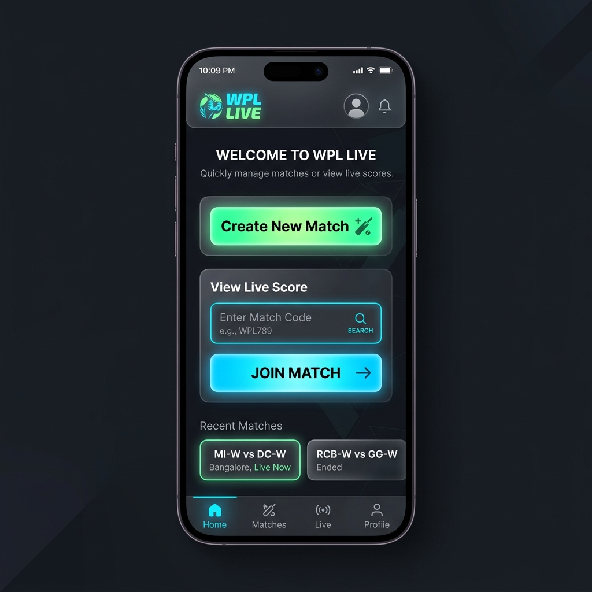
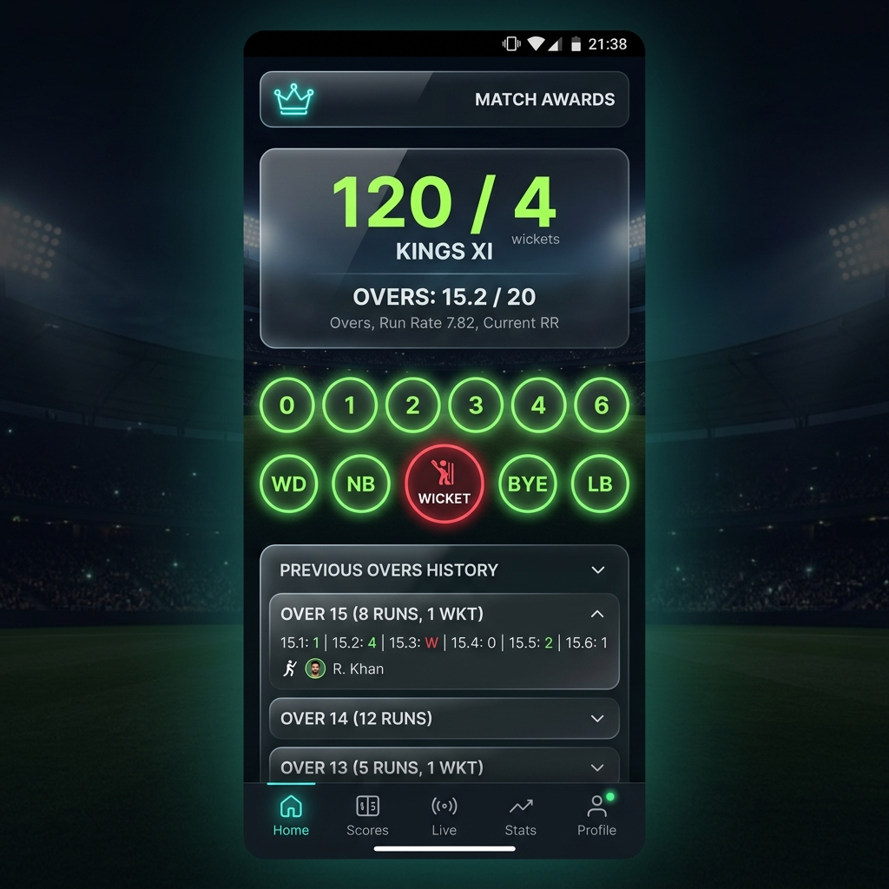

# WPL Scoring App 🏏


A modern, highly responsive, real-time Cricket Scoring Application built with React. Perfect for local tournaments, street cricket, and professional matches. 

The app features a sleek "neon" UI, dedicated umpire controls, real-time synchronization across multiple devices for spectators, automatic handling of complex cricket rules like "Last Man Standing", and comprehensive session management.

---

## 📸 Screenshots

<p align="center">
  
  &nbsp;&nbsp;
  
</p>

---

## ✨ Key Features

- 🟢 **Real-Time Live Scoring:** Viewers from anywhere in the world can track the match live using a unique 6-digit match code. Powered by Firebase Realtime Database.
- 🏟️ **Tournament & Session Management:** Umpires can create a session and host multiple matches sequentially. Players and teams persist across the session, saving setup time.
- 📜 **Over-by-Over History:** A clean, collapsible accordion view to quickly glance at previous overs and the runs scored in them.
- 🏆 **Match Awards:** Automatically calculates the **Man of the Match** (highest run-scorer) and **Bowler of the Match** (highest wicket-taker) at the end of the match.
- 🏏 **"Last Man Standing" Rule:** Automatically handles the scenario where 10 wickets fall but the last remaining batter continues to play without a non-striker.
- 👔 **Umpire (Admin) Controls:** Dedicated admin dashboard to update runs, wickets, extras (wides/no-balls), swap strike, and undo actions.
- 🔄 **Undo Functionality:** Made a mistake? Quickly undo the last ball without breaking the score or over calculations.
- 📱 **Mobile-First Neon UI:** Beautiful dark mode aesthetic with micro-animations, including a custom animated cricket bat and flying ball when a batter hits a "FOUR!" or "SIX!".
- ⚡ **Optimized State Management:** Blazing fast local updates powered by Zustand before syncing to the cloud.

---

## 🛠 Tech Stack

- **Frontend:** React 19, Vite, TypeScript
- **Styling:** Tailwind CSS, Lucide React (Icons)
- **State Management:** Zustand
- **Backend/Database:** Firebase Realtime Database

---

## 📖 How It Works (Application Flow)

### 1. Match Setup
- The Admin/Umpire opens the app and clicks **"Create New Match"**.
- Two teams are defined, and the total overs for the match are set.
- The Admin adds players to **Team 1** and **Team 2**.

### 2. Match Execution (Umpire Mode)
- Once the match starts, a **Unique Match Code** is generated.
- The Admin selects the Striker, Non-Striker, and current Bowler.
- The Admin uses the Umpire Dashboard to record:
  - Runs (0, 1, 2, 3, 4, 6)
  - Wickets (W)
  - Extras (WD, NB)
- Strike rotations happen automatically on odd runs and over completions. 
- Over history updates below the main scoreboard for easy tracking.

### 3. Match Completion & Sessions
- At the end of the match, the **Man of the Match** and **Bowler of the Match** are awarded.
- The Admin can choose to **"Start Next Match in Session"** (retaining players but resetting scores) or **"End Session"** to wipe the state.

### 4. Spectator Mode (Real-Time Viewing)
- Anyone can go to the app's homepage and enter the **Unique Match Code**.
- They are taken to a Read-Only Live Score dashboard.
- As the Umpire taps a button on their phone, the viewer's screen updates instantly via Firebase WebSockets.

---

## 🚀 Installation & Local Setup

### Prerequisites
- Node.js (v18+ recommended)
- A Firebase project with a Realtime Database created.

### 1. Clone the repository
```bash
git clone https://github.com/your-username/wpl-scoring-app.git
cd wpl-scoring-app
```

### 2. Install dependencies
```bash
npm install
```

### 3. Set up Environment Variables
Create a `.env` file in the root directory and add your Firebase credentials:
```env
VITE_FIREBASE_API_KEY=your_api_key
VITE_FIREBASE_AUTH_DOMAIN=your_project.firebaseapp.com
VITE_FIREBASE_DATABASE_URL=https://your_project-default-rtdb.firebaseio.com
VITE_FIREBASE_PROJECT_ID=your_project_id
VITE_FIREBASE_STORAGE_BUCKET=your_project.firebasestorage.app
VITE_FIREBASE_MESSAGING_SENDER_ID=your_sender_id
VITE_FIREBASE_APP_ID=your_app_id
```

### 4. Run the Development Server
```bash
npm run dev
```
Open `http://localhost:5173` in your browser.

---

## ☁️ Deployment

This project is optimized for deployment on [Vercel](https://vercel.com/).

1. Push your code to GitHub.
2. Import the repository in Vercel.
3. In the Vercel deployment settings, go to **Environment Variables**.
4. Add all the `VITE_FIREBASE_*` variables from your `.env` file.
5. Click **Deploy**.

> **Note:** Make sure your `.env` file is included in your `.gitignore` so you don't leak your database keys!

---

## 🤝 Contributing
Contributions, issues, and feature requests are welcome! Feel free to check the [issues page](#).

## 📝 License
This project is [MIT](LICENSE) licensed.
